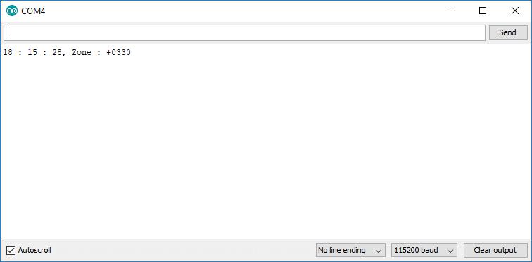

# ESP GET Method test 

This code is testing the ESP8266 with my Iranian calendar api, [Gahshomar](https://gahshomar-api.herokuapp.com)

## The Code 

### Internet Connection 

```c
 WiFi.begin("SSID", "Password"); 

  digitalWrite(RED_LED, HIGH); 
  delay(1000);
  while(WiFi.status() != WL_CONNECTED){
    delay(500); 
    Serial.println("Waiting for connection"); 
    }
   digitalWrite(RED_LED, LOW); 
   digitalWrite(GREEN_LED, HIGH); 
   Serial.println("Connected to the internet"); 
   delay(3000);
``` 

It opens an internet connection over WiFi and also, shows us the connection using LEDs. 

### Getting data from API 

```c 
  HTTPClient http; 
  http.begin("http://gahshomar-api.herokuapp.com/zone/Asia-Tehran"); 
  int httpCode = http.GET(); 

  if(httpCode > 0){
    String payload = http.getString(); 
    Serial.println(payload); 
    }
   http.end(); 
   delay(10000);
``` 

It receives current Tehran time and shows it on a serial monitor. 

## The Result

