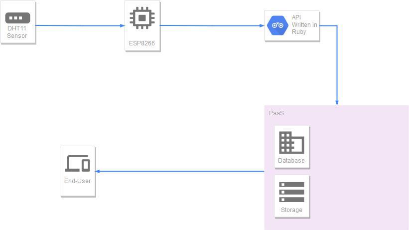

# My final project 

In this repo, I put everything I do for my final project. This is an Internet of Things "IoT" project done for measuring temperature and humidity of an environment. 
I also will add an API which helps to save input data from sensors to the server. 

## The schema of project 

